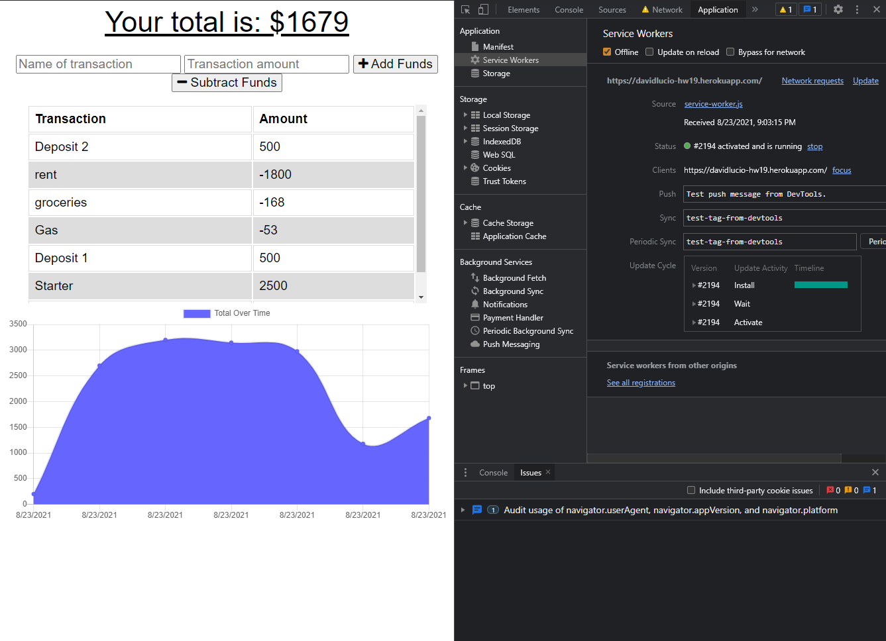

# Offline Budget Tracker App

## By: David Lucio

### Table of Contents

* [Installation](#installation)
* [Usage](#usage)
* [Contributing](#contributing)
* [Tests](#tests)
* [Questions](#questions)

&nbsp;

&nbsp;

> ## **Description** 
> Online/Offline Budget Tracker, made for the UW Coding Bootcamp 
> 
> &nbsp;
>
> ## **Tech used** 
> Javascript, Node.js, Mondo DB, Atlas, Heroku  
>  

*Completed Assignment*: [Deployment Link](https://davidlucio-hw19.herokuapp.com/)

&nbsp;

## **Installation**  
Can be installed locally using "npm i"  

&nbsp;

## **Usage**  
N/A  

&nbsp;

## **Contributing**
Clone the repository separately, and contact david.a.lucio@gmail.com for other contribution requests.  

&nbsp;

## **Tests**  
N/A  

&nbsp;

## **Questions**  

Email: david.a.lucio@gmail.com

GitHub: [davidlucio](http://github.com/davidlucio)  

LinkedIn: [davidlucio](https://www.linkedin.com/in/davidlucio)